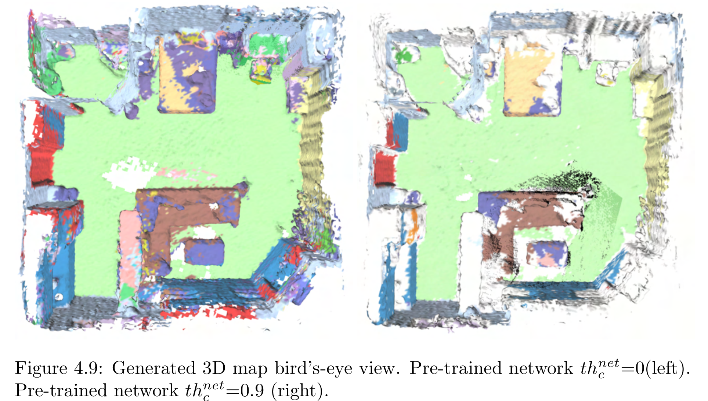

# Kimera Interfacer
 
Kimera Interfacer is a small wrapper around Kimera Semantics.  
We expanded Kimera Semantics with the following capabilities:
 
1. Exporting Voxel Volume using protobuf
2. Generating maps for individual scenes in the ScanNet dataset
3. Ray tracing pseudo labels for semantic segmentation
 
## Overview:

| File                            | Function                                                                                                                                                 |
| ------------------------------- | -------------------------------------------------------------------------------------------------------------------------------------------------------- |
| ```src/kimera_interfacer.cpp``` | Calls Kimera Semantics and provides the Semantic Pointcloud for integration. Exports the created map as a mesh ```.ply``` and the semantic voxel volume. |
| ```scripts/dl_mock.py```        | provides the ScanNet dataset to the correct ros-topics                                                                                                   |
## Configuration:
 Create a folder where to store the output labels 

 ```bash
 mkdir ../generated_labels
 ```
 New pseudo labels will be stored with a unique identifier (idtf) in this directory.
 
```
../labels_generated/idtf/scans/scene0000_00/idtf/*.png
```
The labels are stored using the png encoding with the 3 highest class probabilities to save memory. 
 
Modify all directories depending on the system for the launch config in ```Kimera-Interfacer/kimera_interfacer/launch/predict_generic_scene.launch```:

```yaml
output_dir:               # Folder where to export mesh and smeantic voxel volume data
mapping_scannet_path:     # Path to scannetv2-labels.combined.tsv filw
label_scene_base```       # Where the network predictions are stored
scannet_scene_base```     # Scannet dataset scans-folder: /scannet/scans
```

## Quickstart:
Start roscore
```
roscore
```
 
In other terminal open rviz:
```bash
cd catkin_ws/src
rviz -d Kimera-Interfacer/kimera_interfacer/rviz/dl_mock_scene0000_00.rviz
```

In other terminal command to gernerate multiple maps:
```bash
cd catkin_ws/src/Kimera-Interfacer/kimera_interfacer/scripts
python3 generate_maps.py --exp="ASL/cfg/exp/scannet_self_supervision/create_labels_from_pretrained.yml"
```
Here the exp-files are provided in the [Main Repository](https://github.com/JonasFrey96/ASL) and is used to find the correct idtf used to export labels from the trained network.

\
An example exp-yaml file contains the following: 
```yaml
generate_maps:
 certainty_thershold: 0.5                  # Certainty thershold when a label is integrated into the map
 fps: 2                                    # FPS when creating the map
 voxel_size: 0.05                          # Voxel resolution d_voxel
 label_identifier_out: labels_5_2_conf_05  # Label output name
 sub_reprojected: 2                        # Explained in paper r_sub
 parallel: True                            # Ray tracing multiple maps in parallel
 
label_generation:                             # Config used to generate network predictions
 active: True
 identifier: create_labels_from_pretrained   # Output name
 confidence: 0                               # Always set to 0
 scenes:
   - scene0000_00                            # List of scenes to generate pseudo labels and maps
   - scene0000_01
   - scene0000_02
```
 
 ## Demo Mapping:


Changing the ```generate_maps/certainty_thershold```:




## Generating Pseudo Labels (Ray traying) 

Activate correct python enviornment with all packages installed for ray tracing ([Main repository](https://github.com/JonasFrey96/ASL)) 

```bash
conda activate cl
python scrips/generate_labels.py --exp="ASL/cfg/exp/scannet_self_supervision/create_labels_from_pretrained.yml" 
```

It will output a new folder in the label_scene_base directory with the set label_identifier_out name.